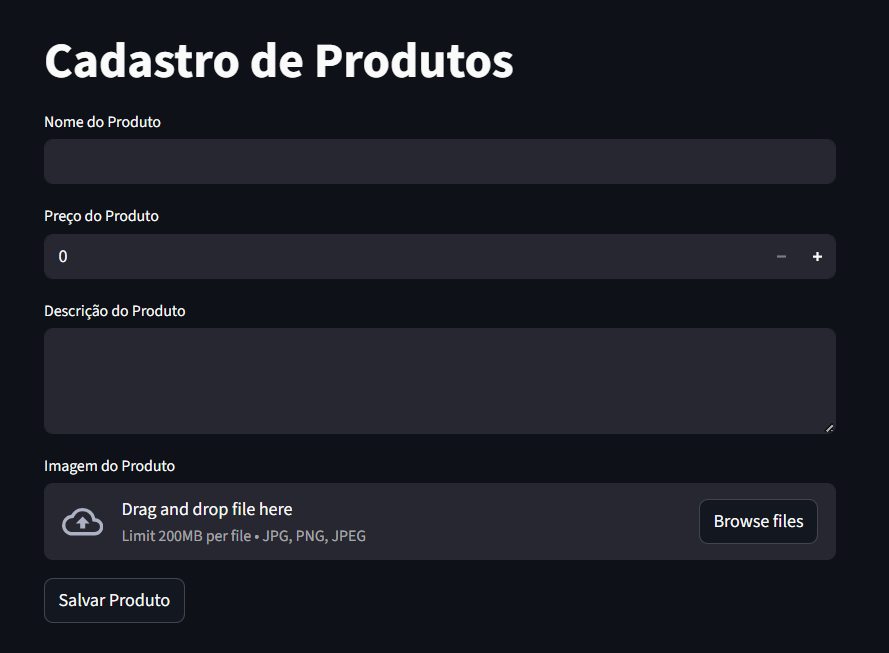
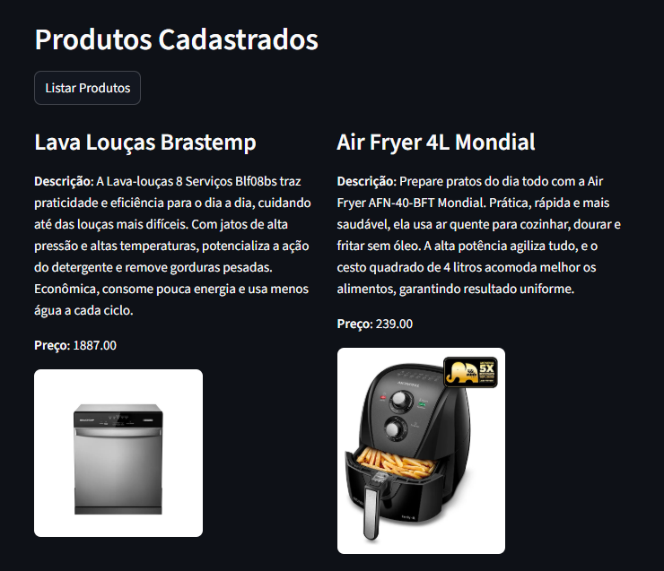

# Projeto de Armazenamento E-Commerce na Nuvem


## 📌 Sobre o Projeto

Este projeto foi desenvolvido durante o curso **Microsoft Azure Cloud Native 2026**, promovido pela Digital Innovation One (DIO). O objetivo foi criar uma solução para armazenar e gerenciar dados de um e-commerce na nuvem, utilizando Azure SQL Server e Azure Blob Storage, com foco em escalabilidade, segurança e eficiência.

## Funcionalidades do Projeto

- Cadastro de produtos com:
  - Nome, preço, descrição e upload de imagem (armazenada no Azure Blob Storage)  
- Listagem dinâmica dos produtos cadastrados com:
  - Nome, descrição, preço e imagem carregada pela URL do Blob
- Integração com Azure SQL Server para armazenar dados e recuperar produtos  
- Interface web interativa com formulários e layout em colunas  
- Tratamento de erros com mensagens e uma exibição detalhada com `traceback`para depuração

## Screenshots do Sistema

### Tela de Cadastro de Produtos


### Tela de Listagem de Produtos


## ▶️ Como Rodar o Projeto

#### 1️⃣ Clonar o repositório

    git clone https://github.com/seu-usuario/seu-repositorio.git
    cd seu-repositorio

#### 2️⃣ Criar e ativar o ambiente virtual (Opcional, mas recomendado)

Windows:

    python -m venv venv
    venv\Scripts\activate

Linux / macOS:

    python3 -m venv venv
    source venv/bin/activate

#### 3️⃣ Instalar as dependências

    pip install -r requirements.txt

#### 4️⃣ Configurar as variáveis de ambiente

Crie um arquivo chamado .env na raiz do projeto e preencha com suas credenciais:

    SQL_SERVER=seu_servidor_sql  
    SQL_DATABASE=seu_banco  
    SQL_USER=seu_usuario  
    SQL_PASSWORD=sua_senha  

    BLOB_CONNECTION_STRING=sua_connection_string  
    BLOB_CONTAINER_NAME=nome_do_container  
    BLOB_ACCOUNT_NAME=nome_da_conta

#### 5️⃣ Criar a tabela no banco de dados

Execute o script SQL abaixo no seu gerenciador de banco de dados:

```sql
CREATE TABLE Produtos (
    id INT IDENTITY(1, 1) PRIMARY KEY,
    nome NVARCHAR(255),
    descricao NVARCHAR(MAX),
    preco DECIMAL(18,2),
    imagem_url NVARCHAR(2083)
);
```

#### 6️⃣ Executar a aplicação

    streamlit run main.py

## Tecnologias Utilizadas

| Tecnologia | Finalidade |
|-----------|------------|
| Python | Lógica da aplicação e integração com serviços da nuvem |
| Streamlit | Interface web interativa |
| Azure SQL Server | Armazenamento dos dados dos produtos |
| Azure Blob Storage | Armazenamento das imagens |
| dotenv | Carregamento de variáveis de ambiente |
| pymssql | Conexão com o banco SQL Server |
| uuid | Geração de nomes únicos para as imagens |

## Aprendizados

- Integração de Python com Azure SQL: permite conectar, inserir e recuperar dados do SQL Server.  
- Gerenciamento de arquivos no Azure Blob: criação de containers, upload e geração de URLs públicas.  
- Uso de variáveis de ambiente para segurança, carregadas com o `dotenv`.  
- Tratamento de exceções e depuração: uso do módulo `traceback` para capturar erros detalhados.  
- Uso do Streamlit: criação de formulários de cadastro e visualização dos produtos.

## 👩‍💻 Autora

Milla Regina Lopes Vieira - [LinkedIn](https://www.linkedin.com/in/milla-regina-468020206/)